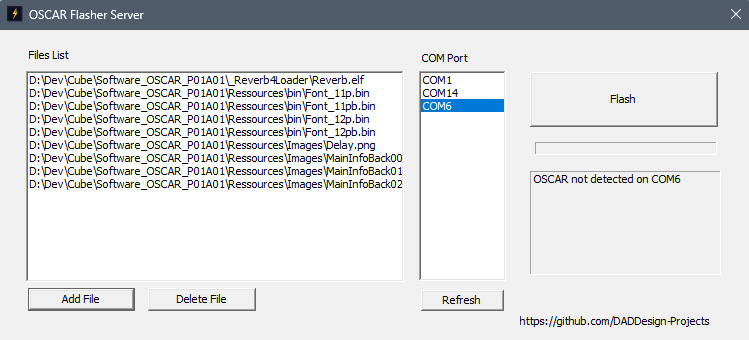

# OSCAR Flasher Server


## 📌 Overview

**OSCAR Flasher Server** is a Windows application used to transfer files to the OSCAR effects pedal via USB.

It works in conjunction with the client:
- https://github.com/DADDesign-Projects/OSCAR_P01_FLasherLoader

---

## ⚙️ Features

- USB communication with the OSCAR pedal  
- File transfer to onboard flash memory  
- Automatic file processing depending on type:

### 🖼️ Image Files
- Supported formats: JPG, PNG, GIF, etc.  
- Automatically converted to **RAW format**  
- Directly compatible with the **STM_GFX** graphics library  
- Used within the **FORGE framework**:  
  https://github.com/DADDesign-Projects/DAD_FORGE  

### ⚙️ ELF Effect Files
- ELF executables are:
  - Parsed  
  - Processed and formatted  
- Ready to be used by the OSCAR loader:  
  https://github.com/DADDesign-Projects/OSCAR_P01_FLasherLoader  

### 📄 Other Files
- Transferred **as-is** without modification  

---

## 🔗 Related Projects

- OSCAR Flasher Loader (client):  
  https://github.com/DADDesign-Projects/OSCAR_P01_FLasherLoader  

- DAD FORGE framework:  
  https://github.com/DADDesign-Projects/DAD_FORGE  

---

## 🚀 Getting Started

### Clone the repository

```bash
git clone https://github.com/DADDesign-Projects/OSCAR_Flasher_Server
```

---

## 🛠️ Build

- IDE: **Visual Studio 2026**
- Platform: **Windows**

---

## ▶️ Usage

1. Connect the OSCAR pedal via USB  
2. Select the corresponding COM port  
3. Launch `OSCAR_FlasherServer.exe`  
4. Select the files to upload:
   - ELF effect programs  
   - Images and assets  
   - Other required files
5. Click **Flash**  
6. Wait until the upload process is complete  
* You can save a complete list of files into a single OFSF file by clicking the Save Files button.
This file can later be reused by simply adding it to the file list, either alone or together with other files.

> ⚠️ **Warning**  
> During flashing process, the entire flash memory is erased before programming.

---
## 🙏 Credits

Special thanks to the following project:

- [ELFIO](https://github.com/serge1/elfio) – used for ELF parsing
  
## 👤 Author

Developed by:  
https://github.com/DADDesign-Projects  

---

## 📄 License

This project is licensed under the **Apache License 2.0**.
